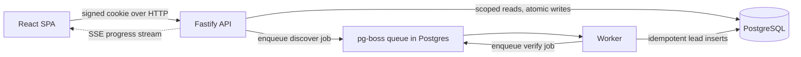

# Lead Discovery Pipeline

A small multi tenant lead discovery tool. A signed in user describes who they want to find, the system runs a two stage background job (discover, then verify), and the results land in an inbox that only their organization can see.

The focus here is on architecture and correctness rather than a fancy interface. Everything runs locally with no paid API keys, and it also accepts real keys when you have them.

## What it does

1. A user submits a search (target companies or keywords, target roles, and a region).
2. The API charges one credit, creates the job with a status of `queued`, and immediately returns a `job_id`. It never blocks while the work runs.
3. A background worker picks up the job and runs two separate stages:
   - **Discover** moves the job to `discovering` and produces candidate leads (name, company, title, an email guess, and a source url).
   - **Verify** moves the job to `verifying`, checks every candidate, and marks each lead as verified or rejected with a reason.
4. The job ends in `completed` (or `failed`), and the inbox shows the leads, filterable by status.

Each lead carries one of three states: `unverified_raw` when it is freshly discovered, `verified` when it passes, and `rejected` when it fails (the rejection reason is stored and shown in the UI). If discovery finds nothing, the job still completes successfully with an empty inbox.

## Scope: what was asked and what I added

### In scope (the requirements)

Everything the brief asked for is implemented.

- **Multi-tenant data model.** Every row carries an `organization_id`, and the active org comes from the session rather than the request body. The `leads` and `credit_transactions` tables reference `search_jobs` through a composite foreign key `(job_id, organization_id)`, so the database itself blocks cross tenant writes.
- **Start a search.** `POST /api/jobs` charges one credit, creates the job as `queued`, and returns the `job_id` right away without waiting for discovery to run.
- **Two stage async pipeline.** Discover and verify run as two separate pg-boss queues, not one synchronous loop inside the HTTP handler. Statuses move `queued`, `discovering`, `verifying`, then `completed` (or `failed`, or `cancelled`).
- **Mock providers behind interfaces.** `DiscoverProvider` and `VerifyProvider` are small interfaces in `packages/shared`. The mock discover is deterministic and seeds some junk emails so verification has something to reject; the mock verify applies simple rules and a score.
- **Inbox.** A status filtered, organization scoped table. Leads are `unverified_raw`, `verified`, or `rejected`, and a rejected lead stores and shows its `rejection_reason`.
- **Credits.** The deduction is atomic with job creation, an organization with no credits is rejected, and an `Idempotency-Key` stops a double click from spending twice.
- **Idempotency and crash recovery.** Leads insert with `ON CONFLICT DO NOTHING` on `(job_id, provider_candidate_key)`, and a stuck job reconciler re drives jobs left mid stage. The reliability section below has the detail.
- **Tests and docs.** 21 automated tests through `npm test`, plus this README and DECISIONS.md.

### Beyond scope (extras I added)

The two biggest additions go past the brief on purpose. The brief lists real SERP and AI parsing as out of scope, but I built both anyway, kept fully optional behind the same `DiscoverProvider` interface so the core still runs with zero keys.

- **Real web search with Tavily.** The guided search can run against the live web instead of mock data. From the companies or keywords, roles, and region it builds targeted queries, calls the Tavily search API, and turns the results into candidate leads with an email guess and a source url, filtering out noise like job postings and listicle pages along the way. It implements the same `DiscoverProvider` interface as the mock, so nothing in the pipeline changes. Lives in `apps/worker/src/providers/tavily-discover.ts`.
- **AI Search mode (Groq plus Tavily).** A second search mode the brief did not ask for at all. Instead of filling in fields, you type a natural language request such as "heads of sales at hotel groups in Malaysia." A Groq hosted language model plans the search, Tavily fetches the sources, and the model then extracts and refines real people from the page content. This is the AI parsing the brief marks out of scope. It also implements `DiscoverProvider`, and `RouterDiscoverProvider` chooses guided or AI based on the request shape. Lives in `apps/worker/src/providers/groq-tavily-discover.ts`.

Both real providers fall back to the deterministic mocks automatically when their keys are missing, and `GET /api/config` plus a banner in the UI make the current mode obvious.

The rest are smaller, and include the brief's listed optional bonuses:

- **Cancel an in flight job (optional bonus).** `POST /api/jobs/:id/cancel` works only while the job is still active, and the verify worker checks for cancellation between leads so it stops promptly.
- **Per organization rate limit on starting searches (optional bonus).** A simple in memory sliding window of five searches per minute per org, returning `429` with a `Retry-After` header. The check runs before the credit charge, so a blocked request never spends a credit.
- **Live progress over SSE** instead of polling, so the UI follows the backend job row in near real time.
- **Zero config local run.** Safe defaults mean `npm run dev` works with no `.env` file at all.
- **Operational niceties.** An Adminer database viewer in the Docker setup, deterministic rejection scores, and a seed that creates five organizations and users with varied credit balances rather than the two requested.
- **Deployment config.** A `render.yaml` for a free tier Render service plus Neon Postgres.

### Deliberately left out

In line with the brief's out of scope list, there is no email sending, no Stripe or real billing, no drag and drop UI, and no mobile app.

## Architecture



The project is a TypeScript monorepo with four parts:

- `apps/web` is the React and Vite single page app. It has the login, the search form, a live progress view, and the inbox.
- `apps/api` is the Fastify server. It owns auth, sessions, tenant checks, credits, and job creation. It never discovers or verifies leads itself.
- `apps/worker` runs the queue consumers and the actual discover and verify stages.
- `packages/db` holds the database schema, migrations, and seed, and `packages/shared` holds the shared types and provider interfaces.

The queue lives inside PostgreSQL through pg-boss, so there is no Redis or extra service to run. That keeps the moving parts low and lets the queue state sit in the same database as everything else, which is easy to reason about for a project this size.

Progress reaches the browser over Server Sent Events. The API watches the job row and pushes an update only when something actually changes, which is lighter than the browser polling on a timer.

## Quick start

You need Docker, or Node 20 and a local PostgreSQL.

### Option A: Docker (one command)

```bash
docker compose up --build
```

This starts PostgreSQL, runs the migrations, seeds the demo data, and launches the API and worker. Open http://localhost:3000 and log in with one of the demo users below. A small database viewer (Adminer) is also available at http://localhost:8081 if you want to look at the tables.

### Option B: Node directly

No `.env` file is required. With no configuration the app falls back to safe local defaults and mock providers, so it runs end to end out of the box.

```bash
npm ci
npm run db:migrate
npm run db:seed
npm run dev
```

The frontend comes up on http://localhost:5173 and the API on http://localhost:3000. The `npm run dev` command starts the API, the worker, and the Vite server together. If you prefer separate terminals, use `npm run dev:api` and `npm run dev:worker`.

You only need an `.env` file if you want to plug in real provider keys or change a default. Copy `.env.example` to `.env` and fill in what you need.

## Demo users

There are no passwords. You log in by picking one of the seeded users. The seed script creates several organizations and users with different starting credit balances, which is what lets you test the credit limit and the tenant isolation. The assessment asked for two organizations and two users with different balances, and the seed goes a little beyond that:

| User         | Email                    | Organization        | Starting credits |
| ------------ | ------------------------ | ------------------- | ---------------: |
| Alex Morgan  | `alex@northstar.demo`    | Northstar Hotels    |               10 |
| Bailey Chen  | `bailey@harborview.demo` | Harborview Group    |                2 |
| Casey Reyes  | `casey@meridian.demo`    | Meridian Consulting |               50 |
| Dana Park    | `dana@atlas.demo`        | Atlas Group         |              100 |
| Jordan Silva | `jordan@solaris.demo`    | Solaris Ventures    |               75 |

Bailey has only two credits on purpose, so you can spend them and watch the next search get rejected for being out of credits. After login the server creates a random server side session and sends only its signed id in an HttpOnly cookie, so the browser never holds the user id or org id directly.

## Running the tests

```bash
npm test
```

There are 20 automated tests. The command spins up a uniquely named test database, runs the migrations against it, runs the suite, and drops it afterwards. The tests cover the parts that matter most: that one organization can never read another organization's jobs or leads, that credits are charged atomically and cannot be double spent, that submitting the same job twice does not create duplicates, and that the discover and verify stages behave correctly including the crash recovery path.

## Mock providers and plugging in a real one

The discover and verify steps sit behind two small interfaces, so a real search or email API can be swapped in later without touching the pipeline:

```ts
interface DiscoverProvider {
  discover(input: SearchRequest): Promise<CandidateLead[]>;
}

interface VerifyProvider {
  verify(candidate: CandidateLead): Promise<VerificationResult>; // { ok, score, reason? }
}
```

The mock discover provider is deterministic, so a given input always returns the same candidates and the demo is repeatable. It returns a varied set of people across different companies and titles, and it mixes in some junk addresses like `info@` and `noreply@` so the verify step always has something to reject. The mock verify provider applies simple rules: it rejects no reply addresses, generic mailboxes, and departmental addresses, and otherwise approves with a score.

I also went ahead and wrote real providers as a working example of how the swap is done, so this is one concrete way to plug a real provider in:

- `apps/worker/src/providers/tavily-discover.ts` calls the Tavily search API for guided searches.
- `apps/worker/src/providers/groq-tavily-discover.ts` uses a Groq model together with Tavily for the natural language search mode.
- `apps/worker/src/providers/router-discover.ts` picks the right one based on the kind of search.

The only place that decides mock versus real is `apps/worker/src/main.ts`. It reads the keys from the environment and builds the real provider when a key is present, or the mock when it is not:

```ts
const guidedProvider = env.TAVILY_API_KEY
  ? new TavilyDiscoverProvider(env.TAVILY_API_KEY, logger)
  : new MockDiscoverProvider();
```

So plugging in your own provider is three steps: implement the interface in a new file under `apps/worker/src/providers`, accept its API key or config in the constructor, and construct it in `main.ts` in place of the mock. Verification works the same way. Today it always uses the mock verifier, and a real email verification service would slot in by implementing `VerifyProvider` and swapping it in `main.ts`. The app exposes a small public endpoint at `GET /api/config` that reports whether real providers are active, and the UI shows a banner when it is running on mock data.

## Reliability and crash recovery

The brief asks what happens if the worker crashes right after discovery, and whether restarting it would insert the same candidates twice. It will not, and here is why.

Every lead is inserted with an idempotent write. The `leads` table has a unique constraint on `(job_id, provider_candidate_key)`, and discovery inserts with `ON CONFLICT DO NOTHING`. The candidate key is derived deterministically from the job and the candidate, so if discovery runs a second time for the same job, every insert that already exists is simply ignored. No duplicates, no need to guess which copy is newer.

That safety net covers three real situations. pg-boss delivers jobs at least once and retries on failure, so a job can run more than once. There is also a stuck job reconciler that periodically looks for jobs left in `discovering` or `verifying` (for example because the worker died mid stage) and re drives them. And there is a deliberate switch, `CRASH_AFTER_DISCOVER_COMMIT`, that simulates a crash right after discovery commits but before the verify stage is queued. You can set it to `true`, watch the worker stop, restart it, and confirm the leads are not duplicated and the job still finishes.

Verify only ever runs after discover has finished and committed. It is a separate queue stage, not a loop tucked inside the HTTP handler, so the two stages stay independent and each can fail and retry on its own.

## Multi-tenancy and credits

Tenant isolation is enforced in the database, not just in the API. The `leads` and `credit_transactions` tables reference `search_jobs` through a composite foreign key of `(job_id, organization_id)`. That means the database itself rejects any attempt to attach data to a job from another organization, even if a future code path forgot to check. Every read is also scoped to the organization on the session, and asking for another org's job or lead id returns a 404.

Charging a credit and creating a job happen in one transaction. The credit is decremented only when the balance is above zero, the job row and a ledger row are written together, and an idempotency key on the request stops a double click or a retry from creating two jobs or spending two credits.

## API surface

```text
POST   /api/auth/demo-login
POST   /api/auth/logout
GET    /api/me
GET    /api/config
POST   /api/jobs
GET    /api/jobs
GET    /api/jobs/:jobId
GET    /api/jobs/:jobId/events     (SSE progress)
POST   /api/jobs/:jobId/cancel
GET    /api/leads
GET    /api/organizations/current
GET    /api/health
```

## Deployment

The repo includes a `render.yaml` and is set up to deploy on a free tier using Render for the app and Neon for PostgreSQL. The production build serves the React app from the same Fastify server, and the worker runs alongside it. When deploying you set `DATABASE_URL` to the Neon connection string, set `APP_ORIGIN` to the final HTTPS url with no trailing slash, and provide a real `COOKIE_SECRET` of at least 32 characters. Cookies become Secure automatically once `APP_ORIGIN` is HTTPS.

A live link will be added here once it is deployed.

## Production next steps

These follow straight on from the decisions and risks above. This is what I would add before calling it production ready.

- **Sharper, more accurate results.** Tune the discovery API calls with better search queries and stronger filtering, so the leads are more relevant and the email guesses more reliable. On the same note, run verification in parallel batches instead of one at a time, with timeouts and sensible retries, so a large job stays quick.
- **Database polish.** Clean up the naming, move to a better id format, drop anything that is no longer used, add the indexes the list queries actually rely on, and switch the inbox to cursor based pagination so large lists stay fast and consistent.
- **An admin area for users and organizations.** Add proper screens to invite and manage users, change which organization someone belongs to, and top up or adjust credit balances, instead of editing the database by hand.
- **Real authentication.** Replace the demo login with real password or single sign on accounts, add multi factor where it matters, and rotate sessions.
- **Failure handling and visibility.** Add alerting and a small dashboard for stage durations, queue depth, retries, and failure rates, along with the tooling to dig into a stuck job and replay it, so a job that keeps failing does not slip by unnoticed.
