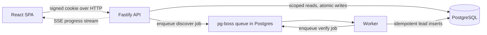

# Lead Discovery Pipeline

A multi tenant tool where a user submits who they want to find, an async two stage job (discover then verify) runs in the background, and verified leads land in an inbox scoped to their organization. It runs locally on mock data with no keys, or against real providers when keys are present.

## Live demo

**https://lead-discovery-pipeline.onrender.com**

Deployed on **Render** (one Docker web service running the API and worker) with **PostgreSQL hosted on Neon**, running in live mode with the real providers. Log in with any demo user below. The free instance sleeps when idle, so the first load can take up to a minute to wake.

## Tech stack

| Layer              | Choice                |
| ------------------ | --------------------- |
| Frontend           | React 19 + Vite       |
| API                | Fastify 5 + Zod       |
| Database           | PostgreSQL            |
| Tests              | Vitest                |
| Language           | TypeScript (monorepo) |
| Deployment         | Docker, Render, Neon  |
| Optional providers | Tavily, Groq          |

## Run it locally

Both options seed demo data and need no configuration. No `.env` is required.

**Docker, one command:**

```bash
docker compose up --build
```

Open http://localhost:3000. A database viewer (Adminer) is at http://localhost:8081.

**Node directly** (Node 20+ and a local Postgres):

```bash
npm ci
npm run db:migrate
npm run db:seed
npm run dev
```

Frontend on http://localhost:5173, API on http://localhost:3000.

To use real providers, add `TAVILY_API_KEY` (web search) and `GROQ_API_KEY` (AI search) to `.env`. **Without them the app uses deterministic mock data and shows a demo banner.**

## Demo users

No passwords. Log in by picking a seeded user. The different credit balances let you test the credit limit and tenant isolation (Bailey has only two credits, so you can spend them and see the next search rejected).

| Email                    | Organization        | Credits |
| ------------------------ | ------------------- | ------: |
| `alex@northstar.demo`    | Northstar Hotels    |      10 |
| `bailey@harborview.demo` | Harborview Group    |       2 |
| `casey@meridian.demo`    | Meridian Consulting |      50 |
| `dana@atlas.demo`        | Atlas Group         |     100 |
| `jordan@solaris.demo`    | Solaris Ventures    |      75 |

## Tests

```bash
npm test
```

21 tests covering tenant isolation, atomic credits, idempotency, and the discover and verify stages including crash recovery. The runner creates a uniquely named test database, runs the suite, and drops it afterwards.

## How it works

It is a real async job system, not a request that blocks until the work is done:

- **Non blocking start.** `POST /api/jobs` charges a credit, writes the job as `queued`, and returns the `job_id` immediately. No discovery or verification runs in the HTTP handler.
- **Two durable stages.** Discover and verify are separate pg-boss queues, so each one runs, fails, and retries on its own instead of being collapsed into one synchronous loop.
- **At least once, but idempotent.** pg-boss can deliver a job more than once, so lead inserts use `ON CONFLICT DO NOTHING` and a reconciler re drives anything left mid stage. Re running a stage never duplicates data.



- `apps/web`: the React SPA (login, search form, live progress, inbox).
- `apps/api`: Fastify. Owns auth, sessions, tenant checks, credits, and job creation. It never discovers or verifies leads.
- `apps/worker`: the pg-boss consumers that run the discover and verify stages.
- `packages/db` holds the Drizzle schema, migrations, and seed; `packages/shared` holds the shared types and provider interfaces.

A job moves `queued`, `discovering`, `verifying`, then `completed` (or `failed`, or `cancelled`). The queue lives inside Postgres through pg-boss, so there is no Redis to run. Progress reaches the browser over Server Sent Events, so the UI follows the backend job row instead of polling on a timer.

**Tenant isolation** is enforced in the database, not only the API. The `leads` and `credit_transactions` tables reference `search_jobs` by a composite key `(job_id, organization_id)`, so the engine itself rejects a job id from another organization, and cross tenant reads return 404. **Credits** are charged in the same transaction that creates the job, and an `Idempotency-Key` makes a double clicked submit spend only once.

## Plugging in a real provider

Discovery and verification sit behind two interfaces in `packages/shared`, so a real API can replace a mock without touching the pipeline:

```ts
interface DiscoverProvider {
  discover(input: SearchRequest): Promise<CandidateLead[]>;
}
interface VerifyProvider {
  verify(candidate: CandidateLead): Promise<VerificationResult>; // { ok, score, reason? }
}
```

A real provider implements the interface, takes its API key in the constructor, and is selected in `apps/worker/src/main.ts`. That file already does exactly this: it builds `TavilyDiscoverProvider` or `GroqTavilyDiscoverProvider` when keys are set, and falls back to the mocks when they are not. Verification works the same way; swap `MockVerifyProvider` for a real one in the same file.

## Crash recovery and idempotency

Every lead is inserted with `ON CONFLICT DO NOTHING` on `(job_id, provider_candidate_key)`, and the candidate key is deterministic, so running discovery twice for a job never creates duplicate leads. That covers three cases: pg-boss delivers jobs at least once and retries on failure, a stuck job reconciler re drives jobs left in `discovering` or `verifying`, and the `CRASH_AFTER_DISCOVER_COMMIT` switch simulates a crash between the two stages so you can verify the behaviour. Verify is its own queue stage that only runs after discover has committed.

## Deployment

One Render web service (Docker) runs the whole system: the container migrates, seeds, then starts the API and worker together, and the Fastify server also serves the React build. Postgres is hosted on Neon.

Set these on the Render service:

| Variable        | Value                                                      |
| --------------- | ---------------------------------------------------------- |
| `DATABASE_URL`  | Neon **direct** string (pg-boss needs the non pooled host) |
| `COOKIE_SECRET` | 32 or more random characters                               |
| `APP_ORIGIN`    | the final `https://...onrender.com` URL, no trailing slash |
| `NODE_ENV`      | `production`                                               |

For the live mode also set `TAVILY_API_KEY` and `GROQ_API_KEY`; leave them out for the mock mode. `GET /api/config` reports which mode is active.

Live link: https://lead-discovery-pipeline.onrender.com

## Beyond the brief

Two of these were on the out of scope list, but I built them as a real example of the provider swap above.

- **Tavily web search (guided mode).** Turns the structured input into targeted search queries, calls the Tavily API, and parses the results into candidate leads, dropping noise like job postings and listicles.
- **AI Search mode (Groq LLM + Tavily).** You type a natural language request. A Groq hosted LLM plans the queries, Tavily retrieves the sources, and the LLM then extracts structured people (name, company, title, email guess) from the returned page content. So the model does the parsing and the search engine does the retrieval. It lives in `apps/worker/src/providers/groq-tavily-discover.ts` and `RouterDiscoverProvider` routes guided versus AI requests.

Both fall back to the mocks with no keys. I also added the optional bonuses: cancelling an in flight job, and a per organization rate limit on starting searches.

## Production next steps

- **Sharper, more accurate results** Better provider queries and stronger filtering, plus verification in parallel batches with timeouts and retries so large jobs stay quick.
- **Database polish** Tidy the naming, use a better id format, add the indexes the list queries need, and move the inbox to cursor based pagination.
- **An admin area** to invite and manage users, change organization membership, and adjust credit balances, instead of editing the database by hand.
- **Real authentication** with passwords or single sign on, multi factor where it matters, and session rotation.
- **Failure handling and visibility** Alerting and a small dashboard for stage durations, queue depth, retries, and failure rates, plus tooling to inspect and replay a stuck job.
